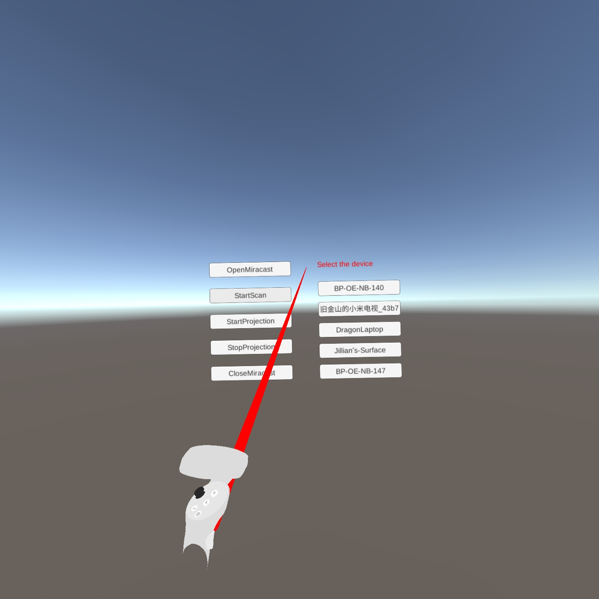

# Miracast In App

- If you have any questions/comments, please visit [**Pico Developer Answers**](https://devanswers.pico-interactive.com/) and raise your question there.

## Description:
This demo shows how to use Pico UnityXR System APIs to implement Miracast in an application.

   

